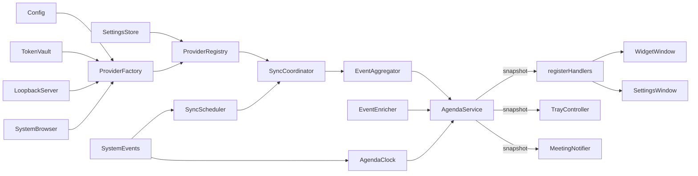

# Pinned Calendar Widget — Build Plan (v3)

**What it is:** an always-on-top macOS widget showing today's calendar. Small and glanceable, on the monitor you choose, visible on every Space (chose where to pin, which monitor, where and how big) and over full-screen apps, living in the menu bar with no Dock icon.

**Why:** persistent peripheral awareness of what's next, so meetings don't ambush you mid-task.

**Stack:** Electron + TypeScript + React + Tailwind. Google Calendar first — a work Workspace account and a personal Gmail account — behind a provider interface, so another source can be added later without a rewrite.

**Who it's for:** yourself first, then colleagues who want it, then anyone, through a public Homebrew tap.

**Security comes first.** Calendar tokens are work credentials. Token handling (§8.2) outranks every other requirement in this document, and the app exposes no attack surface it doesn't need (§8.1).

---

## 1. Stack

Versions checked against the npm registry on 25 Sep 2026. The spec pins major versions; exact versions live in `package-lock.json` (`save-exact`, §8.9).

| Layer        | Choice                                  | Version          | Notes                                                                                                                |
| ------------ | --------------------------------------- | ---------------- | -------------------------------------------------------------------------------------------------------------------- |
| Shell        | Electron                                | 44.x             | Embeds Chromium 152 and Node 24.21. Only the latest three majors get security fixes, so upgrading is part of the job |
| Language     | TypeScript                              | 6.0.x            | `strict: true` everywhere. Not 7.x yet: `typescript-eslint` supports `<6.1`, and its type-aware rules are required   |
| UI           | React                                   | 19.x             | Function components + hooks only                                                                                     |
| Styling      | Tailwind CSS via `@tailwindcss/vite`    | 4.x              | Configured in CSS; no `tailwind.config.ts` (§6)                                                                      |
| Build        | `electron-vite` + Vite                  | 5.x + 7.x        | One config for main, preloads and renderers. Move to Vite 8 when `electron-vite` 6 is stable                         |
| React plugin | `@vitejs/plugin-react`                  | 5.x              | 6.x needs Vite 8                                                                                                     |
| Calendar API | `@googleapis/calendar`                  | 20.x             | Calendar-only client with the same generated types as `googleapis`: 0.85 MB vs 215 MB unpacked                       |
| Auth         | `google-auth-library`                   | 11.x             | The major `@googleapis/calendar` already depends on, so only one copy is installed                                   |
| Settings     | `electron-store`                        | 11.x             | Settings and window state only, never tokens. ESM-only, which Electron 44 supports                                   |
| Validation   | Zod                                     | 4.x              | Every IPC payload is validated in main (§8.5)                                                                        |
| Logging      | `electron-log`                          | 5.x              | No dependencies; size-based rotation; redaction hook (§8.7)                                                          |
| Packaging    | `electron-builder`                      | 26.x             | `.dmg`, signing, notarisation, Electron fuses (§8.8)                                                                 |
| Tests        | Vitest                                  | 5.x              | Shares the Vite config                                                                                               |
| Lint/format  | ESLint + `typescript-eslint` + Prettier | 10.x + 8.x + 3.x | Strict type-checked preset. Pinned like everything else                                                              |

**Removed since v2:**

- `googleapis` — replaced by `@googleapis/calendar`.
- `node-cron` — a managed timer inside `SyncScheduler` is enough (§7).
- `electron-updater` — Homebrew is the update channel (§8.8, §9).
- `vite-plugin-electron` — the file tree always assumed `electron-vite` (`electron.vite.config.ts`); now the table agrees.

**Why Electron:** not because it's the only way to build this — Swift/AppKit and Tauri both do always-on-top and multi-monitor on macOS. It's because TypeScript and React run on both sides of the app, which is where our skills are. The price is memory: an Electron app uses far more RAM than a native widget would. Accept that knowingly.

**On TypeScript:** it's native here, not bolted on. Electron ships its own type definitions, `@googleapis/calendar` is generated from Google's Discovery docs so the Calendar types are accurate, and `electron-vite` compiles TS with zero config. The discipline goes into the IPC boundary — which is exactly where you _want_ types anyway.

---

## 2. Design constraints that shape the structure

Four things drive every decision below:

1. **Providers are swappable.** Google today; EventKit or Microsoft 365 are possible later. The app never knows which one it's talking to.
2. **Multiple calendar sources on screen at once.** Work and personal side by side, or merged into one stream. This is a config change, not a refactor.
3. **The renderer is untrusted.** It never sees a token, never gets a URL it could open, never touches a Node API. Everything privileged lives in main.
4. **Peripheral, never intrusive.** The widget never steals focus from the app you're typing in, never blocks input, and has a one-click privacy mode for screen shares.

If a file would violate one of these, it's in the wrong place.

---

## 3. The provider abstraction

This is the load-bearing idea. Everything else is plumbing.

```
CalendarProvider (interface)
        ▲
        ├── GoogleCalendarProvider      (@googleapis/calendar + OAuth2)
        └── MockCalendarProvider        (tests + offline dev)
```

The interface stays deliberately small:

```ts
interface CalendarProvider {
  readonly kind: ProviderKind
  readonly accountId: AccountId
  authenticate(): Promise<AccountIdentity>
  isAuthenticated(): boolean
  listCalendars(): Promise<CalendarSummary[]>
  fetchEvents(calendarIds: CalendarId[], range: TimeRange): Promise<CalendarEvent[]>
  disconnect(): Promise<void>
}
```

Everything provider-specific — the OAuth dance, Google's event shapes, conference data — stays behind it.

**Typed errors say what to do, not what went wrong inside Google:**

- `ReauthRequiredError` — the refresh token is revoked or expired (`invalid_grant`), or a required scope wasn't granted. Stop syncing that account and show "Reconnect".
- `TransientProviderError` — network failure, timeout, 429 or 5xx. Keep the last-known events, back off, retry (§7).
- Anything else is a bug and bubbles.

**One normalised event shape.** Every provider maps its native response into `CalendarEvent` in `src/shared/`. Google's `summary` becomes `title`; the UI has never heard of Google.

```ts
interface CalendarEvent {
  id: EventId // one per instance: account + calendar + provider event ID
  accountId: AccountId
  calendarId: CalendarId
  iCalUID: string // shared by the same meeting in two accounts (dedupe, §7)
  title: string
  start: string // ISO 8601 with offset
  end: string
  isAllDay: boolean
  conferenceUrl?: string // resolved and allowlisted in main (§8.6); never sent to the renderer
}
```

**Data minimisation.** The mapper keeps only what the UI needs. Descriptions and attendee lists are read for link extraction and your RSVP status, then dropped — never stored, never logged, never sent to the renderer. The renderer receives a smaller view model, `AgendaItem`, with `canJoin: boolean` instead of the URL (§8.5).

**Selected calendars.** One Google account holds many calendars: primary, team calendars, holidays, colleagues'. `listCalendars()` feeds the calendar picker in settings; `AccountConfig.calendarIds` stores the choice, defaulting to the primary calendar only.

**A registry, not a singleton.** The app holds a `ProviderRegistry` — a keyed collection of live provider instances, one per connected account. This is the bit that makes "two calendars side by side" nearly free: you're not special-casing a second calendar, you're iterating a map you already had.

```
accounts: [
  { id: "acc_work",     provider: "google", label: "Work",     colour: "sky",    calendarIds: ["primary", "team-eng@…"] },
  { id: "acc_personal", provider: "google", label: "Personal", colour: "violet", calendarIds: ["primary"] }
]
```

Each account gets its own token entry, its own sync cycle, its own colour. The aggregator merges their events into one sorted stream, tagging each with `accountId`. The UI then either renders one merged column or splits by `accountId` into panes — a view-layer decision, made from the same data.

**Consequence:** the second Google account (Phase 3) is a registry entry, not new code.

**Another vendor is not "one new folder".** v2 claimed Apple Calendar would touch nothing else. It would. EventKit needs native code (a bundled Swift helper or a Node addon), an Info.plist usage string, the hardened-runtime calendars entitlement, a macOS permission prompt and a signed build. iCloud over CalDAV needs an app-specific password typed into our UI and a new network host. The interface absorbs the data shape, not any of that. Apple and Microsoft 365 are "later, optional" (§9).

---

## 4. File structure

```
calendar-widget/
├── electron.vite.config.ts
├── electron-builder.yml             # mac target, hardened runtime, fuses, LSUIElement
├── eslint.config.ts
├── tsconfig.json                    # base, strict
├── tsconfig.node.json               # main + preloads, Node target
├── tsconfig.web.json                # renderers, DOM target
├── .npmrc                           # supply-chain settings (§8.9)
├── .env.example                     # names of build-time config values, never real values
├── Brewfile                         # dev toolchain, installed with Homebrew (§11)
├── build/
│   ├── entitlements.mac.plist       # hardened-runtime entitlements, minimal (§8.8)
│   └── icon.icns
├── resources/
│   └── trayTemplate.png, @2x        # menu-bar template icon
├── .github/
│   ├── dependabot.yml               # npm + GitHub Actions, with cooldown
│   └── workflows/
│       ├── ci.yml                   # lint, typecheck, test, audit on every PR
│       └── release.yml              # tag -> build, sign, notarise, GitHub Release (Phase 4)
│
├── src/
│   ├── shared/                      # imported by BOTH sides — pure code only
│   │   ├── types/
│   │   │   ├── calendar.ts          # CalendarEvent, CalendarSummary, TimeRange
│   │   │   ├── agenda.ts            # AgendaSnapshot, AgendaItem, EventStatus
│   │   │   ├── account.ts           # AccountConfig, AccountStatus, ProviderKind
│   │   │   └── settings.ts          # AppSettings, WidgetPlacement, ViewMode
│   │   ├── ipc/
│   │   │   ├── channels.ts          # channel name constants
│   │   │   └── contract.ts          # Zod schema per channel + inferred payload types
│   │   └── constants.ts
│   │
│   ├── main/
│   │   ├── index.ts                 # entry: create the app, call bootstrap(), nothing else
│   │   ├── bootstrap.ts             # dependency graph construction (§5)
│   │   │
│   │   ├── windows/
│   │   │   ├── WidgetWindow.ts      # the pinned panel (type: 'panel', non-activating)
│   │   │   ├── SettingsWindow.ts    # normal window: accounts, calendars, display, preferences
│   │   │   ├── displayPlacement.ts  # chosen monitor, restore to it, clamp to a live display
│   │   │   └── windowSecurity.ts    # applied to every window: CSP, navigation, permissions (§8.4)
│   │   │
│   │   ├── auth/
│   │   │   ├── LoopbackServer.ts    # one-shot 127.0.0.1 callback listener (§8.3)
│   │   │   └── SystemBrowser.ts     # opens the consent URL in your default browser
│   │   │
│   │   ├── calendar/
│   │   │   ├── CalendarProvider.ts  # the interface + typed errors
│   │   │   ├── ProviderRegistry.ts  # keyed live providers, lifecycle
│   │   │   ├── ProviderFactory.ts   # ProviderKind -> instance
│   │   │   ├── EventAggregator.ts   # merge, sort, dedupe across accounts
│   │   │   ├── EventEnricher.ts     # pure: status, urgency, next-up for a given "now"
│   │   │   ├── conferenceLinks.ts   # pure: extract + allowlist Meet/Zoom/Teams links (§8.6)
│   │   │   └── providers/
│   │   │       ├── google/
│   │   │       │   ├── GoogleCalendarProvider.ts
│   │   │       │   ├── GoogleAuthClient.ts      # PKCE consent, code exchange, revoke
│   │   │       │   └── googleEventMapper.ts     # Google shape -> CalendarEvent, filters (§7)
│   │   │       └── mock/
│   │   │           └── MockCalendarProvider.ts
│   │   │
│   │   ├── agenda/
│   │   │   ├── AgendaClock.ts       # minute-boundary ticks, day rollover, re-ticks on wake
│   │   │   └── AgendaService.ts     # events + clock -> AgendaSnapshot; emits onSnapshot
│   │   │
│   │   ├── tray/
│   │   │   └── TrayController.ts    # menu-bar icon, countdown title, menu
│   │   │
│   │   ├── notifications/
│   │   │   └── MeetingNotifier.ts   # "starts in 1 min", once per event instance
│   │   │
│   │   ├── system/
│   │   │   ├── SystemEvents.ts      # wake, unlock, display changes — one emitter
│   │   │   └── LoginItem.ts         # launch at login
│   │   │
│   │   ├── storage/
│   │   │   ├── SettingsStore.ts     # placement, view prefs, account list — no secrets
│   │   │   ├── TokenVault.ts        # the ONLY code that touches refresh tokens (§8.2)
│   │   │   └── schema.ts            # typed store shape + migrations
│   │   │
│   │   ├── sync/
│   │   │   ├── SyncScheduler.ts     # per-account timers: jitter, backoff, single-flight
│   │   │   └── SyncCoordinator.ts   # fan out to providers, fan in to aggregator
│   │   │
│   │   ├── ipc/
│   │   │   ├── registerHandlers.ts  # the one place channels are registered; sender checks
│   │   │   └── handlers/            # one file per domain: agenda, accounts, window, settings
│   │   │
│   │   └── infra/
│   │       ├── config.ts            # typed build-time config; the only reader of env
│   │       ├── logger.ts            # structured, redacting (§8.7)
│   │       └── errors.ts            # typed error classes
│   │
│   ├── preload/
│   │   ├── widget.ts                # contextBridge: the widget's narrow API
│   │   └── settings.ts              # contextBridge: the settings window's narrow API
│   │
│   └── renderer/
│       ├── widget/
│       │   ├── index.html
│       │   ├── main.tsx
│       │   ├── WidgetApp.tsx
│       │   └── views/
│       │       ├── MergedView.tsx   # all accounts in one stream
│       │       └── SplitView.tsx    # one column per account, side by side
│       │
│       ├── settings/
│       │   ├── index.html
│       │   ├── main.tsx
│       │   ├── SettingsApp.tsx
│       │   └── views/
│       │       ├── AccountsView.tsx        # connect, reconnect, disconnect
│       │       ├── CalendarPickerView.tsx  # which calendars per account
│       │       ├── DisplayView.tsx         # which monitor, which corner
│       │       └── PreferencesView.tsx     # notifications, menu-bar title, theme, login
│       │
│       └── common/
│           ├── components/
│           │   ├── agenda/          # AgendaColumn, EventRow, AllDayStrip, NowMarker, EmptyState
│           │   ├── chrome/          # TitleBar (drag, pin, hide), StatusStrip
│           │   └── ui/              # dumb primitives: Badge, Spinner, Tooltip
│           ├── hooks/
│           │   ├── useAgenda.ts     # subscribes to main's snapshot pushes
│           │   ├── useAccounts.ts
│           │   └── useSettings.ts
│           ├── lib/
│           │   ├── ipcClient.ts     # typed wrapper over window.api
│           │   └── formatTime.ts
│           └── styles/
│               ├── index.css        # @import "tailwindcss" + @theme inline mapping (§6)
│               └── theme.css        # light/dark palette (§6)
│
└── tests/
    ├── unit/
    └── fixtures/                    # recorded Google responses, scrubbed of real data
```

### Why it's shaped like this

- **`shared/` is pure code only.** Types, constants, Zod schemas and pure functions — no Node, Electron or DOM imports — so both sides compile against it. A change to an IPC payload breaks the build rather than breaking at runtime.
- **`providers/` nests by vendor.** Each vendor folder owns its auth client and its mapper. Google's quirks never leak into a shared file.
- **`EventEnricher` is pure and separate from `EventAggregator`.** Merging is about _which_ events; enriching is about _how they look right now_. The urgency rules ("red if within 15 min") live in one testable file with no API and no clock — `now` is a parameter.
- **Main owns time.** `AgendaClock` ticks in main, and the widget, the menu-bar countdown and notifications all read the same `AgendaSnapshot`. There's no renderer clock and no second copy of the urgency rules; v2's `useClock` is gone.
- **Two windows, two preloads.** The widget is a non-activating panel with no text inputs; settings is a normal window. Each preload exposes only what its own window needs.
- **`auth/` is vendor-neutral.** The loopback listener and the system-browser opener don't know about Google, so a second OAuth vendor reuses them unchanged.
- **`AgendaColumn` is the reuse point.** Merged view renders one; split view renders N. Same component, different props. That's the whole multi-calendar feature at the UI layer.
- **`ipc/handlers/` split by domain** so the file you edit when adding an account operation is obvious.
- **`infra/config.ts` is the only reader of build-time env.** Everything else receives typed config through its constructor.

---

## 5. Composition root

`main/index.ts` does almost nothing: create the app, call `bootstrap()`.

`bootstrap.ts` builds the object graph once and passes dependencies down by constructor. Nothing reaches for a singleton, nothing imports a live instance from another module. This is what makes the whole thing testable — point `ProviderFactory` at `MockCalendarProvider` and the entire app runs offline.



- **Main owns time.** One `AgendaClock` (ticks on the minute boundary, re-ticks on wake) drives `AgendaService`. On every tick and every completed sync, `AgendaService` runs `EventEnricher` and emits a fresh `AgendaSnapshot`. The widget, the tray and the notifier all consume that one snapshot, so the urgency rules exist exactly once.
- **Dependencies point one way.** Providers know about auth; coordinators know about providers; `AgendaService` knows about the aggregator and the clock. The IPC layer, the tray and the notifier subscribe to `AgendaService.onSnapshot()` — nothing calls into them, so "nothing knows about IPC" stays true.
- **Sync never touches a window.** `SyncCoordinator` hands results to the aggregator and stops there; `registerHandlers` is what forwards snapshots to windows with `webContents.send`.

---

## 6. Visual design

Professional here means **quiet**. This window sits in your peripheral vision for eight hours; anything loud becomes something you learn to ignore.

### Palette (CSS variables, Tailwind consumes them)

```css
/* theme.css */
:root {
  --bg: #ffffff;
  --bg-subtle: #f8fafc; /* slate-50  */
  --border: #e2e8f0; /* slate-200 */
  --text: #0f172a; /* slate-900 */
  --text-muted: #64748b; /* slate-500 */
  --accent: #0ea5e9; /* sky-500   */
  --urgent: #ef4444; /* red-500   */
  --live: #10b981; /* emerald-500 */
}

@media (prefers-color-scheme: dark) {
  :root {
    --bg: #0f172a;
    --bg-subtle: #1e293b;
    --border: #334155;
    --text: #f1f5f9;
    --text-muted: #94a3b8;
    --accent: #38bdf8;
    --urgent: #f87171;
    --live: #34d399;
  }
}
```

```css
/* index.css */
@import 'tailwindcss';
@import './theme.css';

@theme inline {
  --color-bg: var(--bg);
  --color-bg-subtle: var(--bg-subtle);
  --color-border: var(--border);
  --color-text: var(--text);
  --color-text-muted: var(--text-muted);
  --color-accent: var(--accent);
  --color-urgent: var(--urgent);
  --color-live: var(--live);
}
```

- **Dark mode follows macOS.** v2's `:root:not([data-theme="light"])` wasn't inside a media query, so it applied the dark palette unconditionally and light mode never rendered. The media query fixes that.
- **Manual override without a second palette.** A Light / Dark / System preference sets Electron's `nativeTheme.themeSource` in main, which drives `prefers-color-scheme` in every window. No `data-theme` attribute, no duplicated values.
- **Tailwind 4 is configured in CSS.** `@theme inline` turns the variables into utilities (`bg-bg`, `text-text-muted`, `border-border`), so there's no `tailwind.config.ts`.

Account colours come from a fixed rotation (sky → violet → amber → emerald → rose) assigned at connect time and stored on the account. In split view they tint the column header; in merged view they're a 3px left bar on each row.

### Type & rhythm

- Times: system monospace stack (`ui-monospace, "SF Mono", Menlo, monospace`), 12px, `font-variant-numeric: tabular-nums` so columns align. If you want JetBrains Mono, bundle the font file with the app — the CSP blocks font CDNs and the renderer has no network (§8.4)
- Titles: system UI stack, 13px, medium weight
- Row padding 8px vertical, 12px horizontal; 4px gap between rows
- Corner radius 6px, borders 1px, shadows essentially none — this is a panel, not a card
- The "now" marker is a 1px accent line with a small dot, spanning the column

### State treatment

| State              | Treatment                                                                   |
| ------------------ | --------------------------------------------------------------------------- |
| All-day            | Compact strip above the timeline; no urgency, no notification, no countdown |
| Later today        | Default text, no fill                                                       |
| Starting ≤15 min   | `--urgent` left bar, subtle red tint, time in red                           |
| In progress        | `--live` left bar, subtle green tint                                        |
| Past               | 45% opacity, no bar                                                         |
| Nothing left today | Centred muted line, generous whitespace                                     |
| Needs re-auth      | Muted "Reconnect" line under that account; its last-known events stay       |

### Join button

- Shown on rows whose event has a resolved meeting link (Meet, Zoom or Teams).
- Always visible from 15 minutes before start until the event ends; on hover otherwise.
- Clicking sends the event ID to main, never a URL (§8.6). The rest of the row isn't clickable — the widget is for glancing, not managing.

### Title bar

- Drag region with `-webkit-app-region: drag`; buttons get `no-drag`.
- Pin toggle (always-on-top on/off) and a hide button.
- **"Minimise" means hide to the menu bar.** There's no Dock icon to minimise into; the menu-bar icon brings the widget back.

### Menu bar

- A template icon, so macOS tints it correctly in light and dark menu bars.
- Countdown title, kept short because the MacBook notch hides long menu-bar items: `Standup · 4m`, `Standup · now`, `1:1 · 12m left`. Titles are truncated to about 16 characters; nothing is shown once the day is done.
- **Privacy mode**, toggled from the menu-bar menu: meeting titles become "Busy" in the widget, the menu-bar title and notifications. Turn it on before you share your screen — macOS can't reliably keep the widget out of screen shares (§8.4). It's applied in main, so titles don't even reach the renderer while it's on.
- **Hide meeting titles in the menu bar** (preference) makes that part permanent: the menu bar shows the countdown only, e.g. `4m`.
- Menu: Show/Hide widget · Privacy mode · Move to display ▸ (connected monitors by name) · Sync now · Settings… · Quit. Accounts that need re-auth appear at the top as "Reconnect Work…".

### Notifications

- A native macOS notification before each meeting: default 1 minute, configurable from 0 to 15 minutes, or off.
- Once per event instance (keyed by event ID and start time), however many times the event is re-synced.
- Clicking it joins the meeting if there's a resolved link; otherwise it shows the widget.
- Never for all-day events, declined events or events that have already started.
- In privacy mode the notification says "Meeting in 1 min", with no title.

### Split view

Two columns, one per account, each with a slim tinted header showing the account label. Below about 520px width, split view collapses to merged automatically — the widget is small by nature and narrow columns are unreadable.

### Placement

- **You choose the monitor.** Settings → Display lists connected monitors by name ("Built-in Retina Display", "LG UltraFine"), with a corner preset (top-right, top-left, bottom-right, bottom-left) or "where I left it". The menu-bar "Move to display ▸" does the same in one click.
- The widget appears on every Space and above full-screen apps on that monitor (§10).
- If the chosen monitor is disconnected, the widget moves to the main display, clamped on-screen. When the monitor comes back, the widget returns to it.

---

## 7. Sync model

- **Interval:** per account, default 3 minutes (configurable 1–15), jittered by ±30 s so two accounts don't fire simultaneously. A meeting added 5 minutes before it starts must show up before it starts; v2's 10-minute poll couldn't promise that. Quota isn't a concern at this rate for one person's accounts.
- **Triggers:**
  - the interval
  - wake from sleep (`powerMonitor` `resume`)
  - screen unlock (`unlock-screen`)
  - the day changing at local midnight (from `AgendaClock`)
  - a manual "Sync now" from the menu bar
- **Single-flight per account.** A trigger that arrives while that account is syncing joins the running sync instead of starting another.
- **Time window:** local start of today to end of today, recomputed at every sync, so DST and changing time zones while travelling need no restart.
- **Google query:** `events.list` per selected calendar with `singleEvents=true` (recurring events expanded), `orderBy=startTime`, `timeMin`/`timeMax`, and `eventTypes` = `default`, `focusTime`, `outOfOffice`, `fromGmail` — which leaves out `workingLocation` and `birthday`.
- **Mapper filters:** drop events with `status: cancelled`, and events where your own attendee entry says `responseStatus: declined`. Titles are capped at 200 characters (§8.1).
- **Dedupe:** in merged view, events with the same `iCalUID` and start time — the same meeting invited to both accounts — render once, in the first account's colour. Split view shows both.
- **Tokens:** `google-auth-library` refreshes access tokens itself before they expire. When Google issues a new refresh token, the client's `tokens` event hands it to `TokenVault` (§8.2). No hand-rolled refresh buffer.
- **Push, never poll:** main pushes an `AgendaSnapshot` to the renderer after every sync and every minute tick. The renderer never asks on a timer.
- **On failure:** keep showing last-known events, surface a quiet indicator in the status strip, retry with exponential backoff (30 s doubling to a 10-minute cap, jittered). Never blank the window because a request failed.
- **Auth failures are not retried.** `invalid_grant` or a missing scope raises `ReauthRequiredError`: that account stops syncing and shows "Reconnect" in the widget and the menu bar. Other accounts carry on.
- **Scheduler:** a managed `setTimeout` chain inside `SyncScheduler` — no `node-cron`. Timers don't run during sleep, which is why wake is an explicit trigger.
- **Later, if needed:** incremental sync with `syncToken` if public usage ever strains the project's API quota.

---

## 8. Security

This is the most important section. The app holds long-lived credentials to work calendars, runs all day, and floats above everything else on screen. Two rules come before every other requirement in this document:

1. **Token handling wins.** If a feature needs a token anywhere outside `TokenVault` and the Google provider, the feature changes — not the rule.
2. **No attack surface we don't need.** Every way into the app is listed in §8.1 with its control. Adding a new one means adding a row to that table, or not shipping it.

### 8.1 Threat model and attack surface

A local desktop app, one user per machine. We defend against:

- other apps or malware running as your user, trying to lift tokens from disk or from the process
- web content — the renderer, or anything that manages to navigate it — trying to escalate into main
- **hostile calendar content:** anyone who can send you an invite controls a title, location and description that end up in your widget
- a malicious or hijacked npm dependency
- network attackers
- meeting details leaking through logs, screen shares or crash output

We can't defend against an attacker who already has root, or who can run code inside our signed process. Nothing in-process can.

| Surface                | Exposure                                                             | Control                                                                                                                      |
| ---------------------- | -------------------------------------------------------------------- | ---------------------------------------------------------------------------------------------------------------------------- |
| Refresh tokens at rest | One file per account in `userData`                                   | `safeStorage` ciphertext; the key sits in a Keychain item tied to our code signature; file mode 0600 (§8.2)                  |
| Access tokens          | Main-process memory                                                  | Never persisted, logged or sent over IPC (§8.2)                                                                              |
| OAuth callback         | A local port, during sign-in only                                    | `127.0.0.1` only, random port, one request, exact path, `state` + PKCE, `Host` check, 5-minute timeout (§8.3)                |
| Calendar content       | Attacker-controlled text                                             | Rendered as plain text only; descriptions never reach the renderer; titles capped; links only via the allowlist (§8.4, §8.6) |
| Renderer               | Untrusted web content                                                | Sandbox, context isolation, no Node, strict CSP, no network, no navigation, no new windows, no permissions (§8.4)            |
| IPC                    | The two preload APIs                                                 | Narrow typed APIs, Zod-validated payloads, sender-origin check, no generic `invoke` (§8.5)                                   |
| External links         | `shell.openExternal`                                                 | Only links main resolved itself; `https:` on allowlisted hosts; the renderer sends an event ID, never a URL (§8.6)           |
| Electron entry points  | `ELECTRON_RUN_AS_NODE`, `NODE_OPTIONS`, `--inspect`, loose app files | Disabled with Electron fuses; asar integrity on (§8.8)                                                                       |
| Logs and crashes       | Files on disk                                                        | Exact-key redaction, no event content, no raw HTTP errors, crash reporter off (§8.7)                                         |
| Screen sharing         | Widget, menu-bar title, notifications                                | Privacy mode swaps titles for "Busy" in main before anything is displayed; option to hide titles in the menu bar (§6, §8.4)  |
| Dependencies           | `npm install`, build time                                            | Exact pins, 3-day release-age gate, install scripts off, signature audit (§8.9)                                              |
| Updates                | Homebrew cask                                                        | No in-app updater or update server; brew checks each release's SHA-256; Gatekeeper checks signature and notarisation (§8.8)  |
| Network                | Outbound HTTPS from main                                             | Google endpoints only; no telemetry, analytics or crash upload (§8.10)                                                       |

**Not present, by design:** no listening ports outside sign-in; no OS-registered URL scheme or deep links (the internal `app://` protocol in §8.4 serves our own files and isn't reachable from outside the app); no `<webview>`; no remote content in any window; no auto-updater; no plugins; no clipboard access; no file pickers.

### 8.2 Token handling

- **Only `TokenVault` touches refresh tokens,** and only the Google provider's in-memory `OAuth2Client` holds access tokens. No other module imports either, and no IPC channel returns a token, by construction.
- **At rest:** each account's refresh token is encrypted with Electron's `safeStorage` — the encryption key lives in a macOS Keychain item that only our signed app can read without a prompt — and written to `userData/tokens/<accountId>.bin` with mode 0600, atomically (write a temp file, `fsync`, rename). The `userData` directory itself is set to mode 0700 at startup.
- **No plaintext fallback, ever.** If `safeStorage.isEncryptionAvailable()` is false, refuse to store the token and show an error. Never "temporarily" write it in the clear.
- **Access tokens are memory-only.** They expire within the hour; there's nothing to gain from persisting them.
- **Never in:** logs, IPC payloads, the renderer, `electron-store`, environment variables, URLs, notifications, crash dumps or the clipboard. (`electron-store`'s `encryptionKey` option is obfuscation, not protection — its own docs say so — and we don't use it.)
- **Rotation:** when Google returns a new refresh token (the client's `tokens` event), `TokenVault` replaces the old ciphertext atomically.
- **Per-account isolation:** each account has its own token file and its own client. Revoking or losing one never affects the other.
- **Disconnect revokes first.** Logout calls Google's revoke endpoint, then deletes the ciphertext and drops the in-memory client. If revoking fails (offline), delete locally anyway and tell the user to remove access at myaccount.google.com/permissions.
- **Dead tokens are deleted, not retried.** `invalid_grant` means the refresh token is dead: delete it, mark the account "needs re-auth", and wait for the user. No silent re-consent loops.
- **Identity without extra scopes:** accounts are keyed by the primary calendar's ID (your email address), so the same Google account can't be connected twice, and no `email` or `openid` scope is requested.
- **Uninstall:** the cask's `zap` stanza removes `userData`, including the token files. The Keychain item stays behind but can't decrypt anything once the files are gone.

### 8.3 OAuth flow

- **System browser, not an embedded window.** The consent page opens in your default browser through `SystemBrowser` (`shell.openExternal`). Google blocks sign-in from embedded browsers, Electron included, and the system browser brings your existing Google session, SSO, passkeys and security keys. The app never sees your password.
- **Desktop-app OAuth client with a loopback redirect** (`http://127.0.0.1:<random-port>/callback`), **PKCE (S256)**, and a **`state`** of 32 random bytes compared in constant time.
- **The loopback listener** (`auth/LoopbackServer.ts`):
  - binds to `127.0.0.1` only — never `0.0.0.0`, never `localhost`
  - takes a random port from the OS
  - accepts exactly one `GET /callback`; any other path or method gets 404
  - rejects requests whose `Host` header isn't `127.0.0.1:<port>` (blocks DNS rebinding)
  - answers with a static "You can close this tab" page that echoes nothing from the request
  - closes after the first valid callback, on any error, or after 5 minutes
- **Exchange immediately,** then discard the authorisation code and the PKCE verifier.
- **Request parameters:** `access_type=offline` and `prompt=consent`, so Google always returns a refresh token; no `include_granted_scopes`; only the scopes below.
- **Scopes:** `calendar.events.readonly` + `calendar.calendarlist.readonly`. Read-only, events and the calendar list only: a leaked token can't create, edit or delete anything, can't read calendar settings or sharing, and can't touch Gmail or Drive. If the Phase 0 spike gets a 403 from `calendarList.list` with the granular scope, fall back to `calendar.readonly` and record why here.
- **Check what was actually granted.** Google lets users untick scopes on the consent screen. Without `calendar.events.readonly`, revoke whatever was granted and explain why. Without `calendar.calendarlist.readonly`, carry on with the primary calendar only and hide the calendar picker for that account.
- **Consent screen:** user type **External** (a personal Gmail account can't use a Workspace-only "Internal" client), publishing status **In production** — "Testing" expires refresh tokens after 7 days. Until Google verifies the app, users see an "unverified app" warning and the project is capped at 100 users. Verification is Phase 5.
- **Client ID and secret:** injected at build time from CI secrets and read only by `infra/config.ts`; never committed. Google treats desktop client secrets as non-confidential — they ship inside every copy of the app — and PKCE is what protects the code exchange. They still don't belong in a public repo. Forks bring their own through a git-ignored `.env.local`.
- **Workspace admin:** the work account's admin may need to trust the client ID (Admin console → Security → API controls → App access control). Phase 0 finds out before anything is built.

### 8.4 Renderer and window hardening

All of this lives in `windows/windowSecurity.ts` and is applied to every window at creation. A window that skips it is a bug.

- `contextIsolation: true`, `sandbox: true`, `nodeIntegration: false`, `webSecurity: true`, and `app.enableSandbox()` before any window exists. Non-negotiable.
- **Load from `app://`, not `file://`.** A privileged internal `app://` protocol serves only files from the packaged renderer directory, with path-traversal checks. The `grantFileProtocolExtraPrivileges` fuse is off (§8.8), so `file://` has no special powers either. In dev, the renderer loads from the Vite dev server and nothing else.
- **CSP** on every `app://` response: `default-src 'none'; script-src 'self'; style-src 'self'; img-src 'self' data:; font-src 'self'; connect-src 'none'; base-uri 'none'; form-action 'none'; frame-ancestors 'none'`. Dev builds relax only what Vite's hot reload needs.
- **No network from the renderer, enforced twice:** the CSP above, plus a session `webRequest` filter that cancels any request that isn't to `app://` (or to the dev server, in dev). Everything network goes through main.
- **No navigation, no new windows:** `will-navigate` and `will-redirect` are prevented, `setWindowOpenHandler` always returns `deny`, and `will-attach-webview` is prevented.
- **No permissions:** `setPermissionRequestHandler` and `setPermissionCheckHandler` deny everything — camera, microphone, geolocation, clipboard, web notifications. Native notifications come from main.
- **Calendar content is untrusted text.** It's rendered only as React text nodes: `dangerouslySetInnerHTML` is banned by an ESLint `no-restricted-syntax` rule, and nothing renders HTML or Markdown from events.
- **DevTools are unavailable in production builds** (`devTools: false`).
- **Screen sharing:** the widget still calls `setContentProtection(true)`, but Electron's own docs say apps that capture through macOS ScreenCaptureKit — most current screen-share tools — capture the window anyway. Treat it as a bonus, not a control. The control is privacy mode (§6), which replaces titles with "Busy" in main before they reach the widget, the menu bar or a notification.

### 8.5 IPC boundary

- **Two preloads, two narrow APIs.** Each window gets only the operations it needs. Neither exposes a generic `invoke(channel, ...args)` — that would hand the renderer the whole main process.
- **Validate every inbound payload** in main against the channel's Zod schema: strict objects, bounded strings, known enums. Types vanish at runtime; the boundary needs real checks.
- **Check the sender.** Each handler verifies that `event.senderFrame.url` is the expected origin for that channel — `app://widget` or `app://settings`, or the Vite dev server in dev builds. Anything else is dropped and logged, without its payload.
- **Nothing sensitive crosses.** The renderer receives `AgendaSnapshot` view models — titles, times, colours, status and `canJoin` — never meeting URLs (Zoom links embed passcodes), descriptions, attendees or tokens.
- **Rate-limit side effects.** `agenda:join` and `sync:now` ignore repeats within a second, so a compromised renderer can't spam browser tabs or the API.

The whole IPC surface. Adding a channel means a row here, a Zod schema and a sender check.

| Window   | Channel                                     | Direction       | Payload                                        |
| -------- | ------------------------------------------- | --------------- | ---------------------------------------------- |
| Widget   | `agenda:snapshot`                           | main → renderer | `AgendaSnapshot`                               |
| Widget   | `agenda:join`                               | renderer → main | `{ eventId }`                                  |
| Widget   | `widget:hide`, `widget:setPinned`           | renderer → main | none / `{ pinned }`                            |
| Widget   | `settings:open`                             | renderer → main | none                                           |
| Settings | `accounts:list`                             | renderer → main | none                                           |
| Settings | `accounts:connect`                          | renderer → main | `{ provider: "google" }`                       |
| Settings | `accounts:reconnect`, `accounts:disconnect` | renderer → main | `{ accountId }`                                |
| Settings | `accounts:update`                           | renderer → main | `{ accountId, label?, colour? }`               |
| Settings | `calendars:list`, `calendars:setSelected`   | renderer → main | `{ accountId }` / `{ accountId, calendarIds }` |
| Settings | `displays:list`, `widget:moveToDisplay`     | renderer → main | none / `{ displayKey, corner }`                |
| Settings | `settings:get`, `settings:update`           | renderer → main | none / partial `AppSettings`                   |
| Settings | `sync:now`                                  | renderer → main | none                                           |

### 8.6 External links

- `shell.openExternal` is called from exactly two places: `SystemBrowser` (the Google consent URL, built in main) and the join handler. Nothing else opens URLs.
- **Join:** the renderer sends an event ID. Main looks the event up in the current snapshot, takes the link `conferenceLinks.ts` resolved, and opens it only if it's `https:` on an allowlisted host: `meet.google.com`, `zoom.us` and its subdomains, `teams.microsoft.com`, `teams.live.com`. No other scheme (`file:`, `smb:`, `javascript:`, custom app schemes) and no other host. Each new host is a reviewed change to that allowlist.
- **Link resolution** prefers Google's structured fields (`hangoutLink`, `conferenceData.entryPoints` of type `video`) over parsing `location` or `description` text. Parsed links go through the same allowlist.
- Notification clicks go through the same path.

### 8.7 Logging

- Structured JSON lines through `electron-log`, levels `error` / `warn` / `info` / `debug`; `debug` is off in production builds.
- **Redact by exact key,** recursively, before anything is written: `access_token`, `refresh_token`, `id_token`, `code`, `code_verifier`, `client_secret`, `authorization`, plus `credentials` and `headers`. Our typed errors log Node's error codes under `errorCode`, so redacting `code` loses nothing. v2's regex `/token|secret|authorization|code/i` also redacted `statusCode` — the one thing we want to log.
- **Never log raw HTTP errors.** Google client errors carry the request config, including the `Authorization: Bearer …` header. Map them to typed errors (status code, Google's reason, account ID) at the provider boundary, and log those.
- **Never log event content:** no titles, descriptions, attendees, locations or meeting links. Log counts, durations, status codes and IDs.
- **Size-based rotation:** two files of 5 MB each, in `~/Library/Logs/<App>/`. This replaces v2's weekly rotation and 30-day purge; a bounded size bounds retention on its own.
- **Crash reporter off.** `crashReporter.start()` is never called; nothing leaves the machine.

### 8.8 Build and runtime integrity

**Electron fuses**, flipped at package time by `electron-builder`'s `electronFuses`:

| Fuse                                    | Setting | Why                                                                 |
| --------------------------------------- | ------- | ------------------------------------------------------------------- |
| `runAsNode`                             | off     | `ELECTRON_RUN_AS_NODE` can't turn the app into a plain Node runtime |
| `enableNodeOptionsEnvironmentVariable`  | off     | `NODE_OPTIONS` can't inject code at startup                         |
| `enableNodeCliInspectArguments`         | off     | No `--inspect` debugger attaching to read tokens from memory        |
| `enableEmbeddedAsarIntegrityValidation` | on      | Tampered app code refuses to load                                   |
| `onlyLoadAppFromAsar`                   | on      | No loading app code from outside the validated archive              |
| `grantFileProtocolExtraPrivileges`      | off     | `file://` loses its special powers; we load from `app://`           |
| `enableCookieEncryption`                | on      | Defence in depth; the app relies on no cookies                      |

- **Hardened runtime and notarisation** for every build that leaves your machine (Phase 4).
- **Minimal entitlements:** start with `com.apple.security.cs.allow-jit` only (V8 needs it). No `disable-library-validation`, no `allow-dyld-environment-variables` — each one reopens a code-injection path. Add an entitlement only if the signed build fails without it, and record why here.
- **The Developer ID signature also protects the tokens:** it's how the Keychain decides that the app asking for the `safeStorage` key is really ours.
- **No auto-updater.** Homebrew is the update channel: the cask pins a SHA-256 for every release, and Gatekeeper checks the signature and notarisation on first launch. There's no update server to compromise and no signature-checking code of our own to get wrong.

### 8.9 Supply chain

`.npmrc`:

```ini
save-exact=true
min-release-age=3
ignore-scripts=true
engine-strict=true
```

- **Exact pins** (`save-exact`), `npm ci` in CI, lockfile committed and reviewed like code.
- **Release-age gate:** `min-release-age=3` (days) makes brand-new versions uninstallable for three days — the window in which most hijacked packages are caught and pulled. Needs npm 11.10 or later; `node@24` ships npm 11.19.
- **Install scripts off** (`ignore-scripts=true`). The only one we need is Electron's binary download, which `npm run setup` runs explicitly (`node node_modules/electron/install.js`).
- **CI gates** on every PR and release: `npm audit signatures` (registry signatures and provenance) and `npm audit --audit-level=moderate`.
- **Dependabot** for npm and GitHub Actions, with `cooldown.default-days: 3` so updates respect the same age gate.
- **GitHub Actions** pinned by commit SHA, with least-privilege `permissions:` per job. Signing and notarisation secrets exist only in the release job's protected environment.
- **Repository settings:** secret scanning with push protection, branch protection on `main`, CodeQL (free for public repos).
- **Keep the dependency count low.** Every package is a package that can be compromised. §1 is the complete list of runtime dependencies; adding one needs a reason written there.

### 8.10 Network

- Main talks only to Google: `oauth2.googleapis.com` (code exchange, refresh, revoke) and the Calendar API on `www.googleapis.com`. The consent page on `accounts.google.com` opens in your browser, not in the app.
- `127.0.0.1`, during sign-in only.
- Join links open in your default browser; the app itself never fetches them.
- No analytics, telemetry or crash reporting to anyone.

### 8.11 Distribution

- Anything you give to someone else is signed and notarised first — see the Apple Developer note in §11.
- Phase 0 confirms the Workspace admin allows the OAuth client before anything is built.
- Logout revokes with Google, not just locally (§8.2).

---

## 9. Build phases

**Phase 0 — Toolchain and OAuth spike (go / no-go).** Decides whether the rest is worth building.

1. Install the toolchain with Homebrew (`brew bundle`, §11) and switch the project to `node@24`.
2. Run `npm run setup` on your network and confirm the Electron binary downloads — corporate networks sometimes block GitHub release assets (§11).
3. Create a Google Cloud project with your personal Google account, enable the Calendar API, configure the consent screen (External, In production) and create a Desktop OAuth client (§8.3).
4. Write a throwaway script — not app code — that signs in through the system browser with PKCE for the work account and the personal account, calls `calendarList.list` and today's `events.list` with the granular scopes, then restarts and proves the stored refresh token still works.
5. **Go** if both accounts work. **No-go** paths: ask the Workspace admin to trust the client ID; if that's refused, re-plan around EventKit (macOS Calendar), which needs no OAuth at all.

**Phase 1 — Skeleton on mock data.** `electron-vite` + React + Tailwind building and hot-reloading. The widget as a non-activating panel on every Space and over full-screen apps, on the monitor you choose and restored there. Menu-bar icon and menu, no Dock icon, settings window. `MockCalendarProvider` feeds fake events through the real `AgendaService`, so the full UI, the menu-bar countdown, notifications and the join button all work before OAuth exists. The complete security baseline from §8.4–§8.8 goes in now, not later.

**Phase 2 — Google, one account.** `GoogleAuthClient`, `LoopbackServer`, `TokenVault`, the real provider and mapper, `SyncScheduler`. Calendar picker. Launch at login. Merged view only.

**Phase 3 — Work + personal.** `ProviderRegistry` populated from settings, account management UI, split view, per-account colours, cross-account dedupe.

**Phase 4 — Sharing it with colleagues.** Needs an Apple Developer account (§11).

- Sign with a Developer ID certificate, enable the hardened runtime, notarise and staple — all through `electron-builder`.
- `release.yml`: git tag → build → sign → notarise → `.dmg` on GitHub Releases.
- Create the public tap `EMDevelop/homebrew-tap` with `Casks/pinned-calendar.rb`, including a `zap` stanza (§8.2).
- Colleagues install with `brew install --cask EMDevelop/tap/pinned-calendar`, and `brew upgrade` delivers updates. On a centrally managed Mac the tap may also need to be allowed by policy (§11).

**Phase 5 — Public Homebrew.** Google OAuth verification (homepage, privacy policy, demo video, scope justification) to lift the 100-user cap and remove the "unverified app" warning. A README with install instructions. Submit to the official `homebrew/cask` only once the app is popular enough to meet its notability rules.

**Later, optional.**

- **Apple Calendar through EventKit:** a bundled Swift helper (Xcode is already installed), `NSCalendarsFullAccessUsageDescription` in Info.plist, the `com.apple.security.personal-information.calendars` entitlement, a macOS permission prompt and a signed build. It would cover iCloud and anything else in macOS Calendar, with no credentials in our app.
- **Microsoft 365:** a second OAuth provider on Microsoft's identity platform, with its own consent screen and admin-approval story. It reuses `auth/` unchanged.

---

## 10. Notes for implementation

- `strict: true` from day one. Retrofitting strict mode is miserable.
- No `any` at the IPC boundary — that's the one place it would quietly poison everything.
- Write `MockCalendarProvider` first. It's the difference between a pleasant build and constantly re-authing against a real API.
- Keep `main/index.ts` under 40 lines. If it grows, something belongs in `bootstrap.ts`.
- **Widget window:** `type: 'panel'` floats above full-screen apps, appears on every Space and is non-activating, so clicking it doesn't take focus from the app you're typing in. Add `frame: false`, `alwaysOnTop: true`, `skipTaskbar: true` and `acceptFirstMouse: true` — without the last one, the first click on the inactive panel is swallowed and Join needs two clicks. The widget has no text inputs; anything that needs typing lives in the settings window, which is a normal window.
- **Menu-bar-only:** set `LSUIElement: true` through `electron-builder`'s `extendInfo`, and call `app.dock.hide()` in dev. Still set an application menu with the Edit role — without one, Cmd+C and Cmd+V don't work in the settings window's inputs.
- Window drag region needs `-webkit-app-region: drag` on the title bar and `no-drag` on its buttons, or you can't move the window.
- **Monitor choice and restore:** identify displays by `id` plus `label` and size, because `id` can change across reconnects. Save the chosen display and the widget's position relative to it. On `display-removed`, move to the main display, clamped on-screen; on `display-added`, return to the chosen display if it's back. Test this early with a real external monitor — a saved position on a disconnected display opens the window off-screen.
- **Sandboxed preloads must be CommonJS and fully bundled.** They can't be ESM and can't `require` from `node_modules` at runtime. Keep them tiny: `contextBridge` and `ipcRenderer`, nothing else.
- **Pick the final app name and bundle ID before Phase 2.** The `safeStorage` Keychain item, notification permission and login item are all keyed by them; renaming later forces everyone to sign in again.
- **Launch at login** uses `app.setLoginItemSettings({ openAtLogin: true })`. It only behaves properly for the packaged app in `/Applications`, so test it there.
- **Time zones:** compute "today" in the system time zone on every tick; travelling or a DST change must not need a restart.
- **arm64 only** until an Intel colleague asks; then build a universal binary.
- **Test the security-critical code first:** the `conferenceLinks` allowlist, every IPC schema, `LoopbackServer` (wrong host, wrong path, bad `state`, timeout), `TokenVault` (no plaintext fallback, atomic writes) and logger redaction.

---

## 11. Toolchain checklist

Everything the build needs and where it comes from.

### Prerequisites

- macOS on Apple silicon (arm64)
- Homebrew
- Xcode: `codesign`, `xcrun notarytool`, `xcrun stapler` and `swift` — enough for signing, notarisation and a future EventKit helper
- git

### Replace

- **Any Node older than 24.** Node 20 reached end of life on 30 April 2026 and cannot run this repo's `.ts` scripts. Use Homebrew's `node@24`: it is LTS until April 2028, and it is the same Node that Electron 44 embeds (24.21). If a version manager such as nvm is installed, it will shadow Homebrew's Node — see the note below.

### Install with Homebrew

`Brewfile` (repo root, created in Phase 0):

```ruby
brew "node@24"    # Node 24 LTS with npm 11.19, which supports min-release-age
brew "gh"         # GitHub CLI: repo, releases, tap PRs
brew "actionlint" # optional: lints the GitHub Actions workflows
```

```sh
brew bundle --file=Brewfile
echo 'export PATH="/opt/homebrew/opt/node@24/bin:$PATH"' >> ~/.zshrc  # node@24 is keg-only
exec zsh
node -v  # v24.x
npm -v   # 11.19 or later
```

- If a version manager loads in your shell, it can put its own Node back in front of `node@24`. Remove its lines from your shell profile, or deactivate it before working on this project. `npm run dev`, `build`, `icons` and `spike:oauth` all refuse to run on the wrong version rather than failing cryptically.
- On a centrally managed Mac, installs can be restricted by policy. If `brew install` reports a formula is forbidden, the list above is what to request.

### If npm cannot verify TLS

`npm install` fails every request with `UNABLE_TO_GET_ISSUER_CERT_LOCALLY`, and hangs while it retries.

The cause is not npm. Homebrew's `node@24` is built against shared OpenSSL, which reads its trust store from `/opt/homebrew/etc/openssl@3/cert.pem`. That symlink points at `/opt/homebrew/etc/ca-certificates/cert.pem`, which does not exist: the `ca-certificates` formula is installed, but the post-install step that builds the bundle never ran. Any Homebrew tool that uses shared OpenSSL is affected, not just this project.

Workaround, per command or per shell:

```sh
export NODE_OPTIONS="--use-bundled-ca"
```

That tells Node to use its own embedded CA list instead of the missing system one.

The real fix is `brew postinstall ca-certificates`, which regenerates the bundle. On a centrally managed Mac that is the administrator's call, so the workaround above may be the practical option.

### Not from Homebrew — check these separately

| Need                                | Where it comes from                                  | What to check                                          |
| ----------------------------------- | ---------------------------------------------------- | ------------------------------------------------------ |
| npm packages                        | registry.npmjs.org, or a mirror                      | `npm ping`. With a mirror, set `registry=` in `.npmrc` |
| Electron binary                     | GitHub release assets, downloaded by `npm run setup` | If blocked, set `ELECTRON_MIRROR`                      |
| `electron-builder` helper tools     | GitHub release assets, downloaded at package time    | Same as the Electron binary                            |
| Google Cloud project + OAuth client | console.cloud.google.com                             | Created under whichever account will own the app       |
| Repo, Actions, Pages                | github.com                                           | Public repo, so macOS runners and Pages are free       |
| Apple Developer Program             | developer.apple.com                                  | Only for distribution — see below                      |

### Installing from the tap

Anyone can install with `brew install --cask EMDevelop/tap/pinned-calendar`. Naming the tap in full is enough for Homebrew to trust that one cask.

Since Homebrew 6, packages from an untrusted third-party tap are ignored, and on a Mac where the user is not an administrator they cannot grant that trust themselves. Fleets managed centrally therefore need the tap allowed by whatever manages them, which is a Phase 4 conversation rather than a code change.

### Apple Developer account — when you need it

> To give the app to anyone but yourself, you need Apple Developer Program membership ($99/yr) for a Developer ID certificate and notarisation. Since 1 Sep 2026 Homebrew disables casks that fail Gatekeeper, and `--no-quarantine` is deprecated. Local builds for yourself need neither.

When you get it: create a **Developer ID Application** certificate and an **App Store Connect API key** for `notarytool`, then store them as GitHub Actions secrets in the release environment (`CSC_LINK`, `CSC_KEY_PASSWORD`, `APPLE_API_KEY`, `APPLE_API_KEY_ID`, `APPLE_API_ISSUER`). The future EventKit integration needs a signed build too.

---

## 12. Deviations from the plan, and why

Recorded as the code was written, so this document stays true to the repository.

**Files added beyond §4**

| File                                                                | Why                                                                                                      |
| ------------------------------------------------------------------- | -------------------------------------------------------------------------------------------------------- |
| `main/windows/appProtocol.ts`                                       | §8.4 requires serving the renderer from `app://`; that needs a scheme registration and a request handler |
| `main/calendar/AccountService.ts`                                   | Keeps connect/reconnect/disconnect out of the IPC handlers, which stay thin                              |
| `main/calendar/MeetingJoiner.ts`                                    | One join path shared by the IPC handler and notification clicks, so the allowlist is applied once        |
| `main/ipc/IpcRouter.ts`                                             | The three gates from §8.5 in one place; `registerHandlers.ts` stays a wiring file                        |
| `main/ipc/senderRole.ts`                                            | The sender check as a pure function, so it is testable without Electron                                  |
| `main/system/PreferencesService.ts`                                 | Turns a settings change into its side effects; without it that logic would spread across handlers        |
| `main/infra/Signal.ts`                                              | The typed subscribe/emit primitive §5 depends on                                                         |
| `main/calendar/providers/google/googleScopes.ts`, `googleErrors.ts` | Scope constants and vendor-error mapping, both needed by the provider and the auth client                |
| `shared/ipc/bridge.ts`, `shared/time.ts`                            | The preload API types, and pure date maths used by both processes                                        |
| `scripts/generate-tray-icon.ts`                                     | Generates the template icon from code rather than adding an image dependency (§8.9)                      |

**Changed decisions**

- **`eslint.config.js`, not `.ts`.** ESLint needs the `jiti` package to load a TypeScript config. Avoiding it keeps the dependency count down (§8.9).
- **Token filenames are a SHA-256 of the account id.** Account ids are email addresses. Hashing keeps them out of the filesystem and makes path traversal through a crafted id impossible.
- **Settings file mode.** `electron-store` cannot set a file mode, so the whole `userData` directory is 0700 instead. Verified on disk. Token files are still written 0600 directly.
- **Shared renderer assets.** Each window has its own origin (`app://widget`, `app://settings`) for the sender check, but the bundler emits one shared `assets/` directory. The protocol handler serves documents from the window's own directory and hashed assets from the shared one; both stay under the renderer root.
- **The widget draws a timeline, not a list.** §6 described an agenda list with a now marker. Showing the day to scale — half-hour gridlines, a time gutter, blocks positioned and sized by when they actually are — answers "how far through the day am I", which a list cannot. `DayTimeline` replaces `AgendaColumn`, `EventRow` and `NowMarker`, and the reuse point §4 describes is now its lanes: merged view passes one lane, split view passes one per account so both share a single time axis. The visible span is resolved in main and defaults to 07:00–22:00, widening for anything outside it.
- **Settings parsing merges over defaults.** A strict parse of a file written by an older version fails, and the fallback reset everything — which would silently disconnect the user's accounts on upgrade. Known fields are now taken from the file, missing ones fall back to their default, and unrecognised ones are dropped.
- **One preload, not two.** §4 and §8.5 describe a preload per window. In practice a sandboxed preload cannot `require` anything at runtime, and two entry points made the bundler hoist their shared imports into a chunk that the sandbox then refused to load — `module not found: ./chunks/...`, so neither window could reach main at all. A single entry is always self-contained. Each window still receives only its own API, selected by role from the window URL, and main still checks the sender on every channel, so the isolation §8.5 asks for is unchanged.
- **The preload is type-checked with the renderer**, not with main: it runs in the renderer process and needs DOM types.
- **Closing the loopback listener is bounded.** `server.close()` waits for every connection to end, and the browser holds the callback socket open with keep-alive, so shutting down could stall the sign-in after Google had already returned the code. Connections are now dropped explicitly and the wait is capped at two seconds.
- **The menu-bar icon has no click handler.** With a context menu attached, macOS opens the menu on click, and a competing handler toggled the widget at the same time — hiding the window the user was trying to find.
- **IPC failures carry no `cause`.** Electron serialises a rejected handler error back to the renderer, so the detail is logged in main and the renderer gets a fixed "request rejected" (§8.4).
- **Identity without the calendar-list scope.** §8.2 keys accounts by the primary calendar id. If a user declines the calendar-list scope that address is unavailable, so the account falls back to a random id. It works, but connecting the same account twice would create a second entry.
- **A dev build with no OAuth client seeds a mock account**, so Phase 1 has a populated widget instead of an empty one.

**Still to confirm**

- **Bundle id** is `com.pinnedcalendar.app`. §10 says fix this before Phase 2, because the Keychain item, notification permission and login item are keyed to it.
- **The repository is `EMDevelop/calendar`**, so the public site lives at
  `https://emdevelop.github.io/calendar/` with the privacy policy at
  `.../privacy.html`. Those are the two URLs the Google Branding page needs before
  the app can leave Testing (§9, Phase 0). The Homebrew tap will be a separate
  repository, `EMDevelop/homebrew-tap`.
- **`github.io` may not survive verification.** It is fine for switching to
  production now, but it is a shared domain that cannot be proved in Search
  Console, which Phase 5 brand verification asks for. If that becomes a blocker,
  move the two pages to a domain you own; nothing else changes.
- **Entitlements** are `allow-jit` only. If a signed build fails, add the minimum needed and record the reason here (§8.8).
